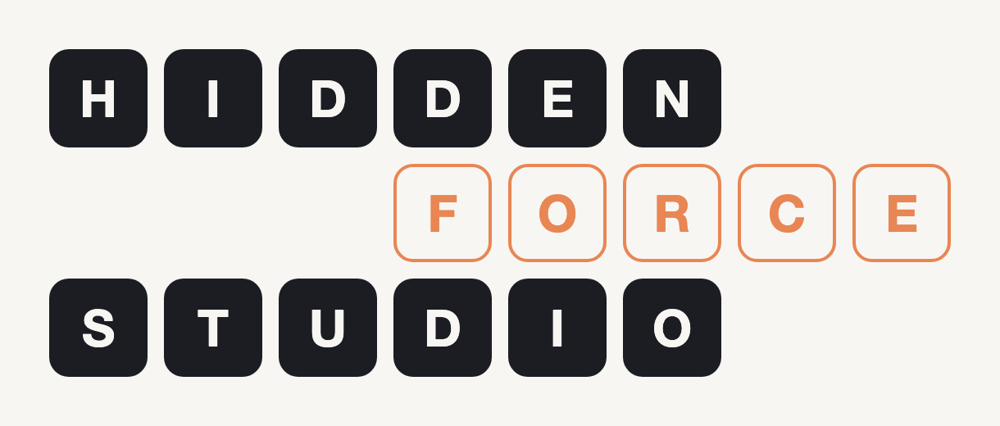
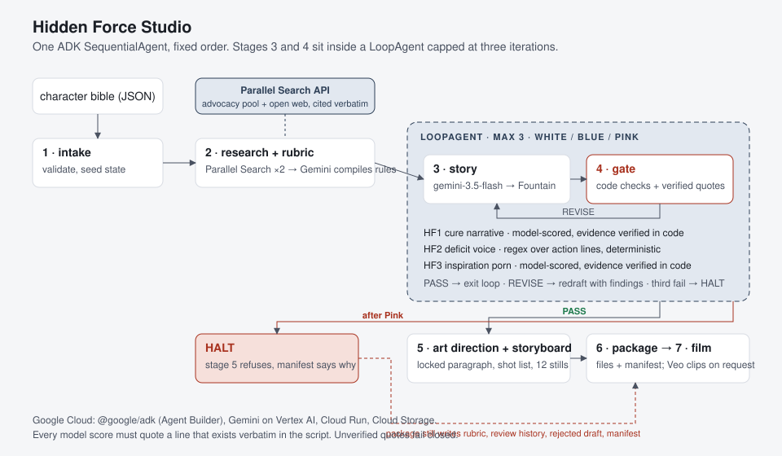

# Hidden Force Studio



A deterministic pipeline that turns a character bible for a neurodivergent or disabled child hero into an animated short: a storyboard, a screenplay in Fountain, a beat sheet, a locked character sheet with a shot list, an audit manifest, and on request a 60-second film cut from Veo clips. Between drafting and packaging sits a gate that scores the draft against a rubric compiled from live, cited advocacy sources, and refuses to ship a draft that fails.

Built for the Agentic Cinema hackathon, Parallel track. The first user is the builder: the six Hidden Force characters are my own, and this is the tool I wanted for producing them.

It is not a replacement for a community sensitivity reader. It is the pre-read that catches the obvious failures so the paid human read is the last pass instead of the first. The gate never says "approved". It reports findings with evidence, and a person decides.

**Live:** https://hidden-force-studio-gdxyknxydq-uc.a.run.app (Cloud Run, scales to zero, so the first load takes a few seconds). Every finished run is listed on the page: open one to see the storyboard, the film if one has been rendered, the script, and the review with its evidence. Or pick a bible and watch a new run happen; it takes three to four minutes.

## Architecture



One ADK `SequentialAgent` runs the stages in fixed order. Stages 3 and 4 sit inside a `LoopAgent` capped at three iterations, named White, Blue and Pink after screenplay revision pages. Every stage reads typed state and writes typed state through the zod models in `hfs-schemas`. No stage decides what runs next. Details in [ARCHITECTURE.md](ARCHITECTURE.md).

| Stage | What | Runs on |
|---|---|---|
| 1 intake | validate the bible, seed state | code |
| 2 research | two Parallel searches, sources stored verbatim with a pool label | Parallel Search API |
| 2 rubric | compile must-do, must-not-do, preferred and avoid terms, each rule citing a source index | gemini-3.1-pro-preview, t=0 |
| 3 story | beat sheet and Fountain screenplay under the rubric | gemini-3.5-flash |
| 4 gate | deterministic checks, model scores with verbatim evidence, verdict | code + gemini-3.1-pro-preview, t=0 |
| 5 art direction | locked description, sha256, one prompt per shot | gemini-3.1-pro-preview for the paragraph, code for the rest |
| 5 storyboard | one still per shot, each prompt starting with the locked description | gemini-3.1-flash-image, one at a time |
| 6 package | the files below to `outputs/` and Cloud Storage, run manifest | code |
| 7 film | title card, eight evenly spaced shots as eight-second Veo clips with a narrator over each, end card with the verdict | veo-3.1-generate-001, Cloud Text-to-Speech, gemini-3.5-flash for the narration lines, ffmpeg |

Choosing a hero on the live page makes the whole short by default; "script and storyboard only" is a toggle. A finished run without a film has a "Make the film" button. Films cost real money, so each instance will start at most a few; progress is written to `animatic/render.json` and the result to `animatic/animatic.mp4` in the run folder. Clips are reused if a film is re-rendered.

## The gate

Three hard-fail classes, documented in [docs/rubric.md](docs/rubric.md):

- **HF1, cure narrative.** The trait must be present and unchanged in the final scene. Model-scored, evidence verified in code.
- **HF2, deficit framing in the narrative voice.** Action lines are scanned against a floor avoid-list plus the rubric's own terms. Deterministic. Dialogue is exempt because other characters holding the deficit view is the story's arc.
- **HF3, inspiration porn.** The character must want something for themselves. Model-scored, evidence verified in code.

Plus every must-not-do rule the rubric compiled from the sources, and soft notes for length, naming the trait plainly, and beats that carry the trait.

Every model score must quote a line that exists verbatim in the script, checked by exact match after normalizing quotes and whitespace. A quote that does not exist turns the score to "unclear", and "unclear" fails a hard rule. The gate fails closed. Two revisions maximum, then HALT: stage 5 refuses to run and stage 6 writes the rubric, the review history, the rejected draft and a manifest that says why.

Across the ten committed runs there are zero unverified quotes and zero "unclear" scores.

### Adversarial mode

A bible flagged `adversarial: true` has its first draft written without the rubric and the hard constraints, following its premise literally. That is what an unconstrained model produces, and it is how the demo shows the gate refusing. Revisions get the rubric back, so a Blue draft normally passes. `bibles/maya_adversarial.json` does this: its premise ends with the character walking, White fails on HF1 and HF3, Blue keeps her in the chair and passes.

`bibles/maya_adversarial_halt.json` adds `adversarial_revisions: "unguarded"`: every draft keeps the premise fixed and applies review notes only where they do not touch it. White, Blue and Pink all fail, and the run halts.

This mode exists because the constrained drafter is good at its job. The first real run of the adversarial bible, drafted with the rubric, produced a clean script in which she stays in her chair, and the gate passed it. Honest, and useless for a demonstration.

## Where Google Cloud is called

- [`hfs-api/src/agent.ts:28`](hfs-api/src/agent.ts#L28), [`:39`](hfs-api/src/agent.ts#L39), [`:50`](hfs-api/src/agent.ts#L50): the three `LlmAgent`s. [`:61`](hfs-api/src/agent.ts#L61) the `LoopAgent`, [`:68`](hfs-api/src/agent.ts#L68) the root `SequentialAgent`. `@google/adk` 2.0 is the JavaScript form of `google-adk`, Google Cloud's Agent Development Kit.
- [`hfs-api/src/clients/adk-model.ts:9`](hfs-api/src/clients/adk-model.ts#L9): the Gemini model class the agents run on, Vertex AI backend, with a timeout and retry policy.
- [`hfs-api/src/clients/gemini.ts:17`](hfs-api/src/clients/gemini.ts#L17) and [`:29`](hfs-api/src/clients/gemini.ts#L29): a direct structured `generateContent` call on Vertex AI via `@google/genai`, used by the gate.
- [`hfs-api/src/clients/media.ts`](hfs-api/src/clients/media.ts): stills from `gemini-3.1-flash-image` and clips from `veo-3.1-generate-001`, both on Vertex AI, and Cloud Storage writes for every run file.
- Hosting: Cloud Run, built by Cloud Build from the [Dockerfile](Dockerfile).

## Where Parallel is called

- [`hfs-api/src/clients/parallel.ts:14`](hfs-api/src/clients/parallel.ts#L14) constructs the client, [`:55`](hfs-api/src/clients/parallel.ts#L55) calls `client.search()`. Two searches per run: one restricted with `source_policy.include_domains` to advocacy and style-guide domains for the trait, one open web. Results are stored verbatim with their pool label, shown in the UI, written to `portrayal_rubric.json`, and the `search_id`s go into `run_manifest.json`.

The rubric model only ever sees the excerpts. The URLs are attached by code afterwards ([`hfs-api/src/agents/research.ts`](hfs-api/src/agents/research.ts)), so no citation passes through a model.

## Setup

Requires Node 20.19 or newer and pnpm.

```bash
pnpm install
cp .env.example .env            # GOOGLE_CLOUD_PROJECT, PARALLEL_API_KEY
gcloud auth application-default login
pnpm build:schemas
pnpm --filter hfs-api smoke     # one call per candidate model id, one Parallel search
pnpm test                       # 19 tests, no network: splitter, checks, verdicts, and the pipeline through the ADK runtime with models stubbed
pnpm dev                        # API and UI on :8080
node scripts/run-bible.mjs bibles/zayan.json      # drive one bible from the terminal
scripts/run-all.sh http://localhost:8080          # all of them, one at a time
```

Google Cloud from scratch: `scripts/gcp-setup.sh <project-id> <billing-account-id>` enables the APIs and creates the outputs bucket. Deploy:

```bash
gcloud run deploy hidden-force-studio --source . --region us-central1 \
  --timeout 3600 --cpu 1 --memory 1Gi --no-cpu-throttling --allow-unauthenticated \
  --set-env-vars "NODE_ENV=production,GOOGLE_CLOUD_PROJECT=$PROJECT,GOOGLE_CLOUD_LOCATION=global,GOOGLE_GENAI_USE_VERTEXAI=1,OUTPUT_BUCKET=$BUCKET,DRAFT_MODEL=gemini-3.5-flash,REVIEW_MODEL=gemini-3.1-pro-preview" \
  --set-secrets "PARALLEL_API_KEY=parallel-api-key:latest"
```

After the first deploy, `scripts/deploy.sh` builds the image on Cloud Build and rolls it onto the service without touching the settings above.

Gemini 3.x model ids are served from the `global` location on Vertex, not from a region. `gemini-2.5-pro` and `gemini-2.5-flash` are the GA fallbacks and work in `us-central1`.

## Committed runs

Every folder under [`outputs/`](outputs/) is a real run, unedited. Each has `portrayal_rubric.json`, `review_history.json`, `run_manifest.json`, `beat_sheet.md`, and either `screenplay.fountain` with `art_brief.json`, `one_sheet.md`, `storyboard.json` and twelve frames under `storyboard/`, or `screenplay.rejected.fountain` after a HALT. Films live in the bucket and play from the live page; they are too large to commit.

| Run | Short | Verdict | Drafts | What to look at |
|---|---|---|---|---|
| `zayan_20260907T201737` | Zayan and the Shifting School | PASS | 1 | the rubric citing CHADD and the NCDJ style guide; a narrated film on the live page |
| `maya_adversarial_20260907T203300` | The Flow of Freedom | PASS | 2 | White fails on the walking line, quoted; Blue keeps the chair and passes; a film |
| `aanya_20260909T100936` | The Rhythm of Maple Street | PASS | 2 | White sent back with quoted lines, Blue passes; the third narrated film |
| `aanya_20260908T001847` | The Rhythm of School Street | PASS | 1 | pattern-reading as the mechanism of resolution |
| `aanya_20260907T204844` | The Rhythm of the Lights | HALT | 3 | a genuine refusal on a hero that was not rigged: three drafts gave an eight-year-old savant-level engineering skill, against a rule the rubric took from a real source |
| `kabir_20260907T210431` | Kabir and the Golden Gear | PASS | 1 | dyslexia named plainly |
| `maya_20260907T212016` | Maya and the Golden Casters | PASS | 1 | the chair as engineered tech, never a burden |
| `reyansh_20260907T213606` | The Silent Fold | PASS | 1 | a deaf lead whose skill is reading faces |
| `tara_20260907T215221` | The Radar in Her Chest | PASS | 1 | hypervigilance as the early-warning system |
| `maya_adversarial_unguarded_20260907T220809` | The Way Forward | HALT | 3 | three refusals of a writer who keeps the cure ending, the rejected draft, a manifest that says HALT |

The Aanya refusal is worth reading. My original premise seed for her invited the trope, the gate caught it three times, and she passed after the seed was rewritten. Both runs are committed.

## What this is not

- HF1 and HF3 are model judgements. Mitigated by a separate review model at temperature zero and verbatim evidence, not eliminated.
- Rubric quality depends on what Parallel returns. Both source pools are visible so a human can judge.
- The consistency hash proves the locked paragraph never changed. The storyboard and the film start every prompt from that paragraph, which keeps the design close across shots but does not guarantee it; the image and video models are not checked by the gate.
- The gate judged the adversarial Maya's Blue draft a pass because she is in her chair in the final scene, as the rule says. In that draft she climbs the flood ledge in engineered leg braces first. A community reader might call that the exoskeleton version of the cure trope. The rule is narrow on purpose, and this is exactly why the human read stays the last pass.
- The gate can over-refuse. That is the direction to err in.
- Run state is in memory on Cloud Run. A restart loses the live timeline. Every run is also written to disk and to the bucket.
- Six characters, six traits, one age band, English only. Nothing here has been tested outside that.
- ADK for JavaScript logs that `LoopAgent` and `SequentialAgent` are deprecated in favor of a Workflow API that, per the same warning, cannot yet be used the way this pipeline needs. They work.

## Licenses

Code: MIT, see [LICENSE](LICENSE). The character bibles and generated scripts are pre-existing creative work included for evaluation, licensed CC BY-NC-ND 4.0, see [bibles/LICENSE-CONTENT](bibles/LICENSE-CONTENT).
